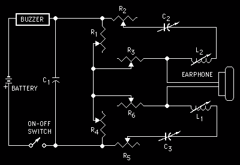
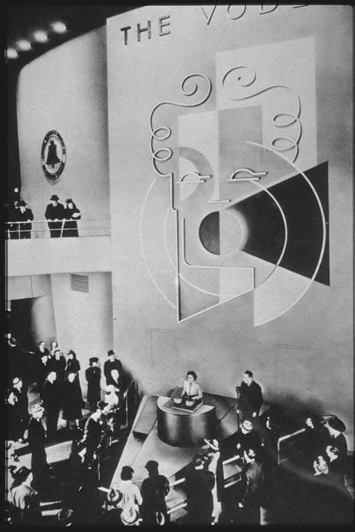
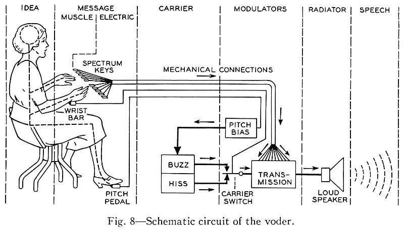
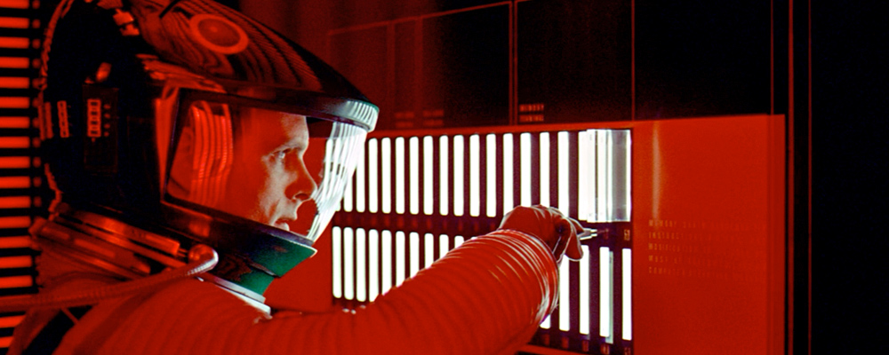
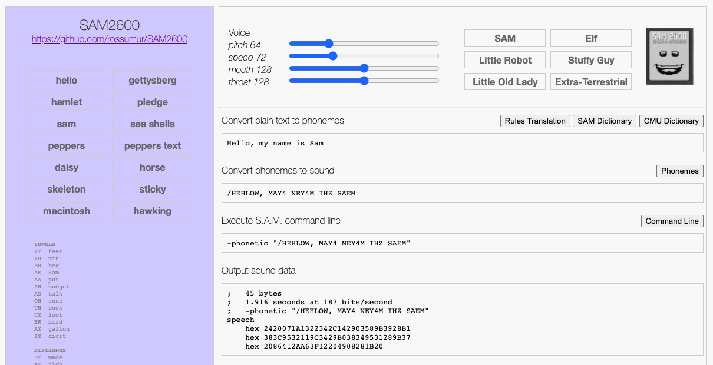

# SAM2600
A software speech synthesizer for the Atari 2600. Make your 2600 talk! Sing! Say rude words!

Add voice to your own games and relive the glory days when computer speech had a charming personality and bounded intelligibility.

## A Brief History of Speech Synthesis
While mechanical speech synthesis dates back to the [18th century](https://en.wikipedia.org/wiki/Wolfgang_von_Kempelen%27s_speaking_machine), the first successful attempt based on electronics was ['An Electrical Analogue of the Vocal Organs'](https://www.nature.com/articles/110311a0) by John Q. Stewart in 1922. It was capable of saying such interesting things as **mama, anna, wow-wow, and yi-yi**.



His circuit consisted of a buzzer to simulate the vocal cords and a pair of oscillators to simulate the resonance of the mouth and throat. By varying the capacitance, resistance and inductance of the circuit he could produce a series of vowel-like sounds; probably the very first example of circuit bending. I would love to see someone recreate this and learn how to play it.

These resonance frequencies are known as **formants**. The human vocal tract has lots of potential for complicated resonances in the mouth, throat, nasal cavities etc. The mouth formant (**f1**) and throat format (**f2**) are critical to creating sounds that are recognizable as speech. The ratio on **f1** to **f2** define the sound of various vowels.

The overall pitch or fundamental frequency of speech comes from oscillations of the vocal cords: the buzzer in this model. Expressive speech depends a lot on correct modulation of pitch. This fundamental frequency is typically known as **f0**.

### The Vocoder
The first device capable of general speech was introduced to the world in 1939. The Bell Telephone Laboratory's [Voder](http://www.whatisthevoder.com/) imitated the human vocal tract and when played by a trained operator could produce recognizable, [albeit creepy](https://www.youtube.com/watch?v=5hyI_dM5cGo), speech.



*The Voder made its first public appearance in 1939 at the New York World’s Fair.*



The Voder performed speech synthesis by emulating some of the behavior of the human vocal tract. It selectively fed two basic sounds, a buzz and a hiss, though a series of 10 bandpass filters. By selecting the buzzing source the machine could produce voiced vowels and nasal sounds, voiceless and fricative sounds were produced by filtering the hissing noise.

If a keyboard and pedals could be used to produce speech then so could a low bitrate digital signal. [Homer Dudley](https://www.cryptomuseum.com/crypto/usa/sigsaly/pat/US3470323.pdf), Voders creator, with the help of Alan Turing went on to contribute to [SIGSALY](https://en.wikipedia.org/wiki/SIGSALY), a compressed and encrypted speech system that successfully secured communications between the likes of Churchill and Roosevelt during the war.

### Daisy
In 1961, physicist John Larry Kelly, Jr used an IBM 704 computer sing the song "[Daisy](https://www.youtube.com/watch?time_continue=5&v=41U78QP8nBk&feature=emb_logo)". This demo inspired one of the greatest moments in all of cinema when Arthur C. Clarke, who was visiting the lab at the time, decided that a certain HAL 9000 would serenade Dave Bowman whilst being lobotomized.


*"My instructor was Mr. Langley, and he taught me to sing a song. If you'd like to hear it I can sing it for you."*

### Talking Chips

By the 70s companies like Votrax were producing discrete logic speech synthesizers and text-to-speech algorithms. The United States Naval Research Laboratory, or "NRL" text-to-phoneme algorithm was developed by a collaboration between Votrax and the NRL in 1973. "[Automatic Translation of English Text to Phonetics by Means of Letter-to-Sound Rules](https://apps.dtic.mil/dtic/tr/fulltext/u2/a021929.pdf)" allowed translation from arbitrary text to phonemes, the smallest units of sound in a word that makes a difference in its pronunciation and meaning. Phonetic alphabets such as [ARPABET](https://en.wikipedia.org/wiki/ARPABET) are used as a common representation of speech to program these devices.

By the end of the 70s and early 80s a variety of integrated circuit speech synthesizers have emerged. The Texas instruments' LPC speech chip family bring the [Speak and Spell](https://en.wikipedia.org/wiki/Texas_Instruments_LPC_Speech_Chips) to life but early versions could only play back a fixed set of words.

The Votrax SC-01, famous for its use in the arcade games like Gorf, Wizard of Wor, Q-bert (where Q-bert would swear with random phonemes) was one of the first affordable simple formant synthesizers that could produce arbitrary speech; phoneme input was rendered into sequences of formants for vowels, and filtered noise for consonants and unvoiced sounds.

Chips like the SC-01 (Alien Group Voice Box) and the GI-SPO256 (Intellivoice) started to appear in peripherals for the growing personal computer market. The stage was set for a cheaper, more versatile software alternative.

### Software Automatic Mouth (SAM)

In 1982 Don't Ask Software (now SoftVoice, Inc.) released  **S.A.M. The Software Automatic Mouth**, a voice synthesis program for Atari, Apple and Commodore computers written by Mark Barton. At $59.95 ([at lest for the Atari version](https://www.youtube.com/watch?v=k7nqixe3WrQ)) it was much cheaper than the hardware alternatives. It included a text-to-phoneme converter and a phoneme-to-speech routine for the final output.

SAM used a rule based translation of text to speech that owes a lot to the NRL work from 1973. It used formant synthesis to generate sounds in a way that is efficient enough to run in the limited enviroments of home computers of that area. There were a few limitations: the Atari and Commodore versions needed to disable the screen while generating audio which limited the kinds of applications that could be created, and the Apple 1 bit speaker modulation sounded a little rough. But the overall effect was magical - software was talking, and in some cases, singing.

[To help introduce the Macintosh in 1984](https://youtu.be/2B-XwPjn9YY?t=193) Steve Jobs turned to Mark Barton and Andy Hertzfeld to bring SAM to a new audience as MacinTalk: https://www.folklore.org/StoryView.py?project=Macintosh&story=Intro_Demo.txt

## How SAM2600 Works

After 38 years I have finally got around to answering a question I pondered to myself in 1982 when I first heard SAM talk on my Atari 800: *Could SAM run on something as constrained as an Atari 2600?*

A 2600 only has 128 bytes of RAM vs 48k on the 800, a ratio of 1:384. It has a slower clock (1.19Mhz vs 1.79Mz), no disk drive etc. But it had the same CPU architecture and similar audio hardware: an exotic 4 bit DAC. Surely there was a way.....

When [Sebastian Mackie](https://github.com/s-macke/SAM) created a C version of SAM from disassembled 6502 code my interest was rekindled. Although the batch generation of phonemes from text and then sound from phonemes was well beyond the memory capacity of the 2600 I realized that splitting the process and thinking of the problem more like a Voder could make something that would fit on the console.

Internally SAM has a three stage pipeline: text to phoneme, phoneme to allophone, allophone to pcm. Allophones are sounds, a phoneme is a set of such sounds (long vowels and diphthongs have two allophones, plosives often have three, other phonemes just have one).

The first two stages are rules based and have a non-trivial code footprint. If you are trying to put a game onto a 4k cartridge there isn't a whole lot of room. But the allophone to pcm stage looks a little more manageable.

### Fitting into an Atari 2600

SAM2600 separates the complex rule based parts from the allophone to pcm stage. The code that runs on the 2600 is analogous to playing the Voder, a compressed stream of phoneme/allophone/timing data. The complex stuff is moved to a web based authoring tool were tons on RAM and compute make it easy to create and share interesting speech.



[The SAM2600 Authoring Tool](https://rossumur.github.io/SAM2600/SAM2600.htm) produces a compressed format designed to be compact but easy to interpret at runtime. Individual phoneme/allophones are encoded as two or three bytes. Pauses are encoded as 1 byte. This format encodes speech at around 25-30 bytes per second, roughly the speed of a 300 baud modem.

```
// Compress samples into atari runtime version
// A sample is encoded as 1,2 or 3 bytes
// Sample timing units are in VBLs so PAL and NTSC are going to be a bit different

//	0: 0x00 			end of sequence

//	0: 0x01-0x4F		formant index
//	1: run:5 mix:3 		run (how long the phoneme lasts) and mix (duration of mixing with last phoneme)

//	0: 0x50-0x7F  		silence frame count + 0x50

//	0: 0x81-0xCF		(formant index | 0x80)
//  1: pitch 			updated pitch value (f0)
//	2: run:5 mix:3 		run (how long the phoneme lasts) and mix (duration of mixing with last phoneme)

//	0: 0xD0-0xFF		escape code + 0xD0 for signaling
```
One of the delights of programming the Atari 2600 is the proximity of the code to the hardware generating the video and audio. Unlike the Atari 8 bit computers there is no DMA, interrupts or other modern conveniences that get in the way of generating real time media. [I love systems like that](https://rossumblog.com/?s=arduinocade).

The challenge is to integrate the speech engine into some other useful context that wants to draw on the screen do some useful processing. The solution is that SAM2600 only uses every second line to generate samples (at a rate of 7860 samples/second) which is plenty for speech. Some creativity will be required operate in this mode but 2600 programmers are a scrappy bunch.

The speech engine uses a stream of phonemes that index a table of formant frequencies (**f1** and **f2**) and amplitudes. These values (**f1,a1,f2,a2**) are interpolated alongside a fifth parameter, pitch (**f0**) during VBL to produce smoothly varying speech. These format tables can be modified to produce voices of different gender, age and planet of origin.

If the phoneme is unvoiced ('S' in *She Sells Sea Shells*) the engine selects hardware noise of the appropriate frequency and volume.

In voiced phonemes, formant frequencies are used in DDS of a sinewave to produce two of the three tones required for intelligble speech. The two values are summed together and output to a 4 bit DAC: the channel volume register **AUDV1**.

Pitch is incredibly important to reproducing intelligible speech and given we only have ~70 cycles to produce a sample, modulation of **f1,f2** by the glottal pulse that produces pitch would seem impossible. SAM had a brilliant trick for this: resetting the DDS counters every pitch period produces a nice **f0** buzz with very little CPU time.

It is remarkable how much SAM2600 has in common with Stewart's work from 1922. A buzzer and two formant frequencies mixed dynamically will get you there.

The speech engine only uses 33 bytes of RAM and 1.2k of ROM leaving up to 2.8k for speech in a 4k cartridge. This is enough for about 2 minutes of continuous unique speech, or as much as you like with fancy bank switching.

The examples use ~.5k to produce an animation that maps phonemes to mouth shapes. These mappings are far from perfect but the effect seems to work ok.

## The Future

In the decades since SAM was created speech synthesis has evolved tremendously. Progress in the last couple of years has been greatly accelerated by advances in deep learning: rule based approaches and heuristics have given way to huge networks and eerily accurate results.

If someone out there has time on their hands I would love to see modern deep learning based TTS applied to the SAM2600 engine. The data format is expressive enough to produce much more accurate prosody and expressiveness than what is possible to create with rule based approaches.

Looking forward to see what folks do with this,

Rossum

www.rossumblog.com

